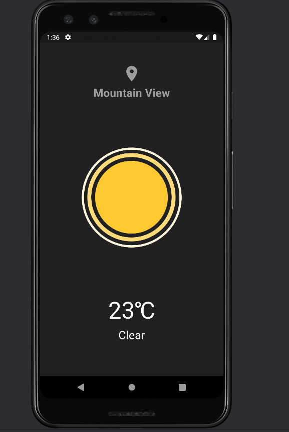

# Quick Weather App

Quick Weather is a simple Flutter app that displays the current weather information based on the user's location. It uses the OpenWeatherMap API to fetch weather data and the Geolocator plugin to get the user's current location.

## Features

- Displays the user's current city based on their location
- Shows the current temperature in Celsius
- Displays a weather animation based on the current weather condition
- Supports various weather conditions like clear, clouds, rain, etc.

## Screenshots

## Getting Started

To get started with the Quick Weather app, follow these steps:

1. Clone this repository.
2. Get an API key from [OpenWeatherMap](https://openweathermap.org/api) and replace `'YOUR_API_KEY_HERE'` in `WeatherService` class with your actual API key.
3. Run the app on a simulator or a physical device.

## Dependencies

- [geolocator](https://pub.dev/packages/geolocator) - For getting the user's current location.
- [geocoding](https://pub.dev/packages/geocoding) - For converting coordinates to a readable address.
- [http](https://pub.dev/packages/http) - For making HTTP requests to the OpenWeatherMap API.
- [lottie](https://pub.dev/packages/lottie) - For displaying weather animations.

## Contributing

Pull requests are welcome. For major changes, please open an issue first to discuss what you would like to change.

## License

[MIT](https://choosealicense.com/licenses/mit/)
